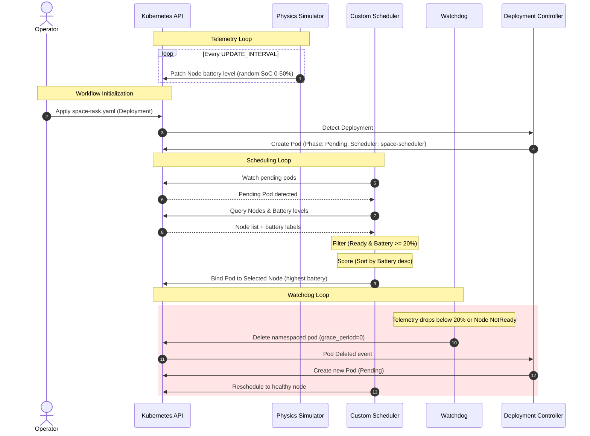

# Space Cloud (Version 1): Energy-Aware Kubernetes Orchestration for Satellite Edge Computing

This repository contains **Space Cloud - Version 1**, a prototype framework designed to address the challenges of resource orchestration, energy constraint management, and dynamic fault tolerance in satellite edge-computing constellations. The system leverages Kubernetes (simulated locally via a Kind cluster) to manage containerized mission workloads on simulated satellite nodes, enforcing energy-aware scheduling and real-time descheduling policies ("Flight Rules") based on simulated battery telemetry.

---

## 1. Scientific & Academic Context

In modern aerospace engineering, the paradigm is shifting from traditional "Bent-Pipe" satellites (which simply relay data to ground stations) to **Edge-Computing Satellite Constellations**. By running containerized payloads (e.g., AI inference for Earth observation, real-time signal processing) directly in orbit, satellites can process data locally and downlink only the high-value insights, dramatically reducing bandwidth requirements.

However, operating Kubernetes in space introduces unique challenges:

1. **Orbital Energy Constraints**: Satellites rely on solar arrays and batteries. A satellite entering the shadow of the Earth (eclipse/umbra phase) experiences zero solar generation, and its battery State of Charge (SoC) depletes.
2. **Transient Node Availability**: Solar-storm induced hardware faults or severe battery depletion can take a satellite worker node offline.
3. **Control Plane Overhead**: Traditional Kubernetes control loops poll continuously, creating excessive API traffic which is highly undesirable on resource-constrained satellite hardware.

**Space Cloud - Version 1** implements an energy-aware scheduler and a descheduling watchdog mechanism to enforce operational safety bounds, ensuring that mission-critical payloads are dynamically relocated to satellites with sufficient energy reserves.

---

## 2. System Architecture

The framework consists of four main operational layers: the **Telemetry and Physics Simulator**, the **Custom Energy-Aware Scheduler**, the **Descheduling Watchdogs (Polling and Reactive)**, and the **Ground Segment Orchestrators**.

```mermaid
graph TD
    subgraph Space Segment (Satellite Constellation)
        Node1[Satellite Worker Node 1]
        Node2[Satellite Worker Node 2]
    end

    subgraph Control Plane (Ground Segment / Master Node)
        K8sAPI[Kubernetes API Server]
        Sched[Custom Space Scheduler]
        WD[Watchdog / Descheduler]
        Deploy[Deployment Controller]
    end

    Sim[Physics Simulator] -. updates battery level .-> Node1
    Sim -. updates battery level .-> Node2
    
    K8sAPI -- Node Status & Battery Labels --> Sched
    K8sAPI -- Node Status & Battery Labels --> WD
    
    Sched -- 1. Filters & Scores Satellites \n 2. Binds Pod --> K8sAPI
    WD -- Evicts Pods on low energy/fault --> K8sAPI
    Deploy -- Recreates evicted Pods --> K8sAPI
```

### Operational Workflow Sequence



---

## 3. Component Details & Specifications

### 3.1. Telemetry and Physics Simulator

* **Source File**: [physics_sim.py](file:///home/aless6/Scrivania/Thesis-Polimi-Guazzi/Version%201/physics_sim.py)
* **Functionality**: Simulates the physical power subsystems (Electrical Power System - EPS) of the satellite constellation. It runs an infinite loop in [main()](file:///home/aless6/Scrivania/Thesis-Polimi-Guazzi/Version%201/physics_sim.py#L14) to:
    1. Scan the active Kubernetes nodes via `v1.list_node()`.
    2. Filter out control-plane master nodes to safeguard cluster infrastructure.
    3. Generate a simulated battery State of Charge (currently simulated as a random integer between 0% and 50% in line 61).
    4. Patch the node metadata label `spacecloud.io/battery_level` (configured via `LABEL_KEY` in line 9) with the updated value every `UPDATE_INTERVAL` (20 seconds).
* **Thesis Context**: Represents the telemetry loop. In a real flight software deployment, this simulator would be replaced by an orbital mechanics module (e.g., computing eclipse times based on Simplified General Perturbations-4 / SGP4 models) coupled with physical battery chemistry state-of-charge estimators.

### 3.2. Custom Energy-Aware Scheduler

* **Source File**: [space_scheduler.py](file:///home/aless6/Scrivania/Thesis-Polimi-Guazzi/Version%201/space_scheduler.py)
* **Functionality**: A custom scheduling engine written to bypass default Kubernetes scheduling policies. It runs a loop in [main()](file:///home/aless6/Scrivania/Thesis-Polimi-Guazzi/Version%201/space_scheduler.py#L123) and listens to Pod creation events.
* **Scheduling Algorithm (Three-Stage Pipeline)**:
    1. **Filtering**:
        * Excludes control-plane nodes.
        * Validates node health status (checks if the node condition type `Ready` is `True`).
        * Retrieves battery telemetry from the node's labels using [get_node_battery()](file:///home/aless6/Scrivania/Thesis-Polimi-Guazzi/Version%201/space_scheduler.py#L26).
        * Applies the **Flight Rule (Soglia Critica)**: Discards nodes with battery levels below the `MIN_BATTERY` threshold of 20% (line 20).
    2. **Scoring**:
        * Sorts all eligible candidate nodes in descending order of energy reserves.
        * Assigns the pod to the node with the absolute highest battery level to maximize mission duration and distribute power degradation.
    3. **Binding**:
        * Initiates a pod binding command to the selected node via [schedule_pod()](file:///home/aless6/Scrivania/Thesis-Polimi-Guazzi/Version%201/space_scheduler.py#L48).
        * *Developer Note*: It utilizes `_preload_content=False` in [create_namespaced_binding()](file:///home/aless6/Scrivania/Thesis-Polimi-Guazzi/Version%201/space_scheduler.py#L93) to bypass a known response-parsing validation bug in the Python Kubernetes SDK.

### 3.3. Watchdogs (Safety Controllers / Deschedulers)

In LEO missions, resource environments are highly dynamic. A satellite that was scheduled when its battery was at 80% will eventually enter an eclipse, causing its battery to drain. To avoid hardware damage or sudden mission loss, we implement a **Watchdog** (Descheduler) that monitors node status and evicts active workloads when conditions deteriorate.

This repository implements two alternative watchdog architectures to allow comparative analysis:

#### Option A: Polling Watchdog

* **Source File**: [space_watchdog.py](file:///home/aless6/Scrivania/Thesis-Polimi-Guazzi/Version%201/space_watchdog.py)
* **Functionality**: Implements a time-triggered controller. Every `CHECK_INTERVAL` (3 seconds, line 19), [main()](file:///home/aless6/Scrivania/Thesis-Polimi-Guazzi/Version%201/space_watchdog.py#L57) performs a full cluster scan:
    1. Downloads all node battery levels using [get_node_batteries()](file:///home/aless6/Scrivania/Thesis-Polimi-Guazzi/Version%201/space_watchdog.py#L25).
    2. Queries all active pods in the namespace.
    3. Identifies pods belonging to the mission (`app=space-app`).
    4. Evicts the pod immediately (`grace_period_seconds=0`) if the hosting node's battery drops below 20%.

#### Option B: Reactive Watchdog (Event-Driven)

* **Source File**: [space_watchdog_reactive.py](file:///home/aless6/Scrivania/Thesis-Polimi-Guazzi/Version%201/space_watchdog_reactive.py)
* **Functionality**: Implements an event-triggered controller using Kubernetes Watch stream (`w.stream(v1.list_node)`). When a node resource is modified (e.g., its battery label is patched by the simulator), the stream yields an event instantly.
* **Advanced Features**:
    1. **Hardware Failure Detection**: Prioritizes node status checks using [is_node_ready()](file:///home/aless6/Scrivania/Thesis-Polimi-Guazzi/Version%201/space_watchdog_reactive.py#L32). If a node transitions to `NotReady`, it triggers evacuation immediately, bypassing battery checks.
    2. **Resource & Traffic Optimization**: Instead of listing all pods in the cluster, [evict_pods_on_node()](file:///home/aless6/Scrivania/Thesis-Polimi-Guazzi/Version%201/space_watchdog_reactive.py#L46) applies a server-side `field_selector=spec.nodeName={node_name}`. This isolates the query to the single affected node, dramatically reducing bandwidth and CPU usage.
    3. **Silent Operations**: If no mission pods are active on the low-battery node, the watchdog exits silently without log emission, preventing telemetry log flooding.

| Architectural Metric | Polling Watchdog ([space_watchdog.py](file:///home/aless6/Scrivania/Thesis-Polimi-Guazzi/Version%201/space_watchdog.py)) | Reactive Watchdog ([space_watchdog_reactive.py](file:///home/aless6/Scrivania/Thesis-Polimi-Guazzi/Version%201/space_watchdog_reactive.py)) |
| :--- | :--- | :--- |
| **Control Paradigm** | Time-Triggered (Polling) | Event-Driven (Reactive Stream) |
| **API Overhead** | High ($O(N)$ requests every $T$ seconds) | Low (Push-notifications on status change) |
| **Reaction Latency** | Dominated by poll interval (average $\frac{T}{2}$) | Real-time (milliseconds) |
| **Hardware Failure Support** | Indirect (relies on label update failure) | Direct (monitors `Ready` status condition) |
| **Bandwidth Consumption** | Constant and High | Dynamic and Low |

---

## 4. Deployment and Workload Specification

Workloads are declared using Kubernetes standard deployment manifests, augmented with metadata specifying the custom scheduler.

* **File**: [space-task.yaml](file:///home/aless6/Scrivania/Thesis-Polimi-Guazzi/Version%201/space-task.yaml)
* **Deployment Configuration**:
  * `name`: `missione-ai`
  * `schedulerName`: `space-scheduler` (tells the default Kubernetes scheduler to ignore this workload).
  * `labels`: `app: space-app` (targets it for watchdog monitoring).
  * **Resource Constraints**:
    * `requests`: `memory: "64Mi"`, `cpu: "100m"` (guaranteed launch resources).
    * `limits`: `memory: "128Mi"`, `cpu: "200m"` (strict safety resource ceiling to prevent thermal/power runaways).

---

## 5. Execution Guide

### 5.1. Prerequisites

1. **Kubernetes Local Cluster**: Install [Kind](https://kind.sigs.k8s.io/) or [Minikube](https://minikube.sigs.k8s.io/docs/).
2. **Cluster Configuration**: Create a cluster with at least 2 worker nodes and 1 control-plane node.
3. **Python Environment**: Install the Python Kubernetes client:

    ```bash
    pip install kubernetes
    ```

4. **Kubeconfig**: Ensure your command prompt or terminal has access to the cluster (i.e. `kubectl get nodes` works).

### 5.2. Ground Segment Emulation Launch

To facilitate orchestration, the repository contains two PowerShell ground segment initialization scripts. These launch the physics simulator, custom scheduler, and chosen watchdog in separate terminal windows.

#### Running Polling-based Architecture

Run the following script:

```powershell
./launch_mission.ps1
```

This spawns:

* **Terminal 1**: Telemetry & Physics Simulator ([physics_sim.py](file:///home/aless6/Scrivania/Thesis-Polimi-Guazzi/Version%201/physics_sim.py))
* **Terminal 2**: Custom Space Scheduler ([space_scheduler.py](file:///home/aless6/Scrivania/Thesis-Polimi-Guazzi/Version%201/space_scheduler.py))
* **Terminal 3**: Polling Watchdog ([space_watchdog.py](file:///home/aless6/Scrivania/Thesis-Polimi-Guazzi/Version%201/space_watchdog.py))

#### Running Reactive-based Architecture (Recommended)

Run the alternative script:

```powershell
./launch_mission_reactive.ps1
```

This spawns:

* **Terminal 1**: Telemetry & Physics Simulator ([physics_sim.py](file:///home/aless6/Scrivania/Thesis-Polimi-Guazzi/Version%201/physics_sim.py))
* **Terminal 2**: Custom Space Scheduler ([space_scheduler.py](file:///home/aless6/Scrivania/Thesis-Polimi-Guazzi/Version%201/space_scheduler.py))
* **Terminal 3**: Reactive Watchdog ([space_watchdog_reactive.py](file:///home/aless6/Scrivania/Thesis-Polimi-Guazzi/Version%201/space_watchdog_reactive.py))

### 5.3. Testing Pod Scheduling and Self-Healing

Once the ground segment is running:

1. **Deploy the Workload**:

    ```bash
    kubectl apply -f space-task.yaml
    ```

2. **Observe the Scheduling Phase**:
    In Terminal 2, you will see the scheduler read node battery levels, filter out low-energy candidates, score the remaining nodes, and bind the Pod to the satellite node with the highest charge.
3. **Observe the Eviction and Self-Healing Loop**:
    When the telemetry simulator ([physics_sim.py](file:///home/aless6/Scrivania/Thesis-Polimi-Guazzi/Version%201/physics_sim.py)) generates a battery level below 20% on the node hosting the pod:
    * The watchdog detects the threshold breach.
    * It issues a force deletion (`grace_period_seconds=0`) on the Pod.
    * The deployment controller detects the deleted pod and creates a replacement in a `Pending` state.
    * The custom scheduler detects the new `Pending` pod and schedules it to a different, healthy node (battery >= 20%).

---

## 6. Academic Contributions & Thesis Analysis

When presenting this project in a Master's Thesis context, the following core design considerations should be emphasized:

1. **Energy as a First-Class Scheduling Constraint**: Unlike classic cloud environments where CPU, memory, and storage are the primary dimensions, edge scheduling in space elevates energy status to a primary constraint. Workload performance must be dynamically traded off against the remaining battery capacity of the hosting spacecraft.
2. **Micro-scheduling vs. Descheduling separation of concerns**: Separating the scheduling mechanism ([space_scheduler.py](file:///home/aless6/Scrivania/Thesis-Polimi-Guazzi/Version%201/space_scheduler.py)) from the runtime watchdog ([space_watchdog_reactive.py](file:///home/aless6/Scrivania/Thesis-Polimi-Guazzi/Version%201/space_watchdog_reactive.py)) keeps the architecture modular and aligned with Kubernetes API design patterns. This mimics standard descheduler architectures used in enterprise environments but adapted for satellite battery flight rules.
3. **API Resource Overhead Trade-offs**: The comparison between polling and reactive paradigms demonstrates concrete performance trade-offs. For real satellite missions, minimizing network packet transmission over inter-satellite links (ISLs) is crucial; hence, the reactive, event-driven pattern is mathematically superior, yielding significantly lower control-plane communication overhead.
