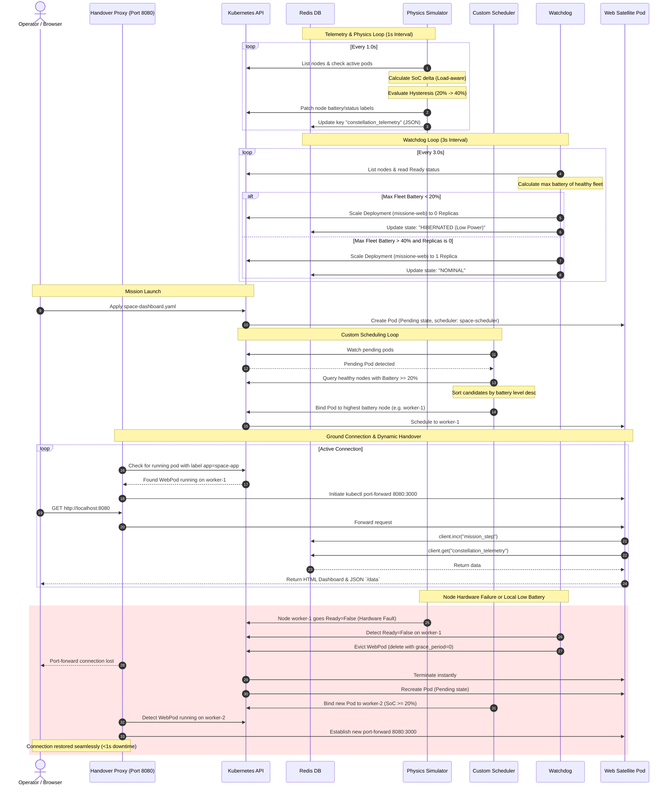

# Space Cloud (Version 2): Shared Memory State, Hardware-Aware FDIR, and Dynamic Web Dashboard for Satellite Edge Computing

This repository contains **Space Cloud - Version 2**, an advanced, production-grade iteration of the satellite edge orchestration framework. Building upon the baseline concepts of Version 1, this version introduces a centralized data-sharing architecture using Redis, a multi-tiered safety control system leveraging battery state hysteresis, true hardware-fault detection (Fault Detection, Isolation, and Recovery - FDIR), a live HTML5 SVG-animated orbital dashboard, and a resilient, auto-reconnecting ground-segment proxy handling sub-second client handovers.

---

## 1. Scientific & Academic Context

Operating Kubernetes clusters in Low Earth Orbit (LEO) requires solving several physics-constrained resource management challenges:

1. **Deterministic Orbital Physics**: Satellites move through alternating sunlight (insolation) and shadow (umbra/eclipse) phases. In Version 2, we simulate this via a precise time-based orbital model ($T_{\text{orbit}} = 60\text{s}$) where charging only occurs during the `SUN` phase, and discharging occurs during `ECLIPSE`.
2. **Workload-Aware Power Dynamics**: Battery degradation and drain rates are not uniform; they depend on CPU load. The simulator implements differential power consumption equations:
   * **Insolation (Sun)**:
     $$\Delta \text{SoC}_{\text{charge, idle}} = +5.0\%/\text{s}$$
     $$\Delta \text{SoC}_{\text{charge, active}} = +1.0\%/\text{s}$$
   * **Umbra (Eclipse)**:
     $$\Delta \text{SoC}_{\text{discharge, idle}} = -0.5\%/\text{s}$$
     $$\Delta \text{SoC}_{\text{discharge, active}} = -2.0\%/\text{s}$$
3. **Threshold Thrashing & Hysteresis**: In Version 1, a satellite hovering near the $20\%$ critical boundary would trigger continuous cycles of pod eviction, rescheduling, and re-eviction as the battery fluctuates slightly due to charge/discharge. Version 2 resolves this by implementing a **Hysteresis Loop** state machine:
   * A satellite enters a `CRITICAL` state and shuts down workloads when State of Charge (SoC) drops below $\text{Threshold}_{\text{Shutdown}} = 20\%$.
   * A critical satellite is only allowed to transition back to `OPERATIONAL` and accept new workloads when its charge recovers above $\text{Threshold}_{\text{Restart}} = 40\%$.
4. **Physical Hardware Failures (FDIR)**: Telemetry systems must distinguish between battery depletion (temporary power loss) and hardware faults (e.g., radiation-induced latch-ups). Version 2 reads the physical Kubernetes Node `Ready` condition directly. If a node transitions to `NotReady`, it triggers an immediate `HARDWARE_FAILURE` event, triggering instant relocation of workloads.
5. **Decoupled State via Centralized Telemetry**: Control plane components and application payloads must not query the Kubernetes API repeatedly for custom telemetry to avoid saturating low-bandwidth inter-satellite links (ISLs). Version 2 uses an in-cluster **Redis Database** as a centralized state bus.
6. **Sub-second Client Handover**: When a satellite node goes offline or is evicted, the workload is rescheduled onto a different satellite. A ground station viewing the payload's web dashboard would normally suffer a TCP connection break. The Version 2 ground script implements an auto-reconnecting proxy loop, achieving sub-second handover by immediately binding the local port to the new hosting satellite's IP as soon as it enters the `Running` phase.

---

## 2. System Architecture

The Version 2 framework expands the control loops by adding Redis and an interactive dashboard:

```mermaid
graph TD
    subgraph Control Plane / Master Node (Ground Segment & Orchestrator Node)
        K8sAPI[Kubernetes API Server]
        Sched[Custom Space Scheduler]
        WD[Reactive Hardware-Aware Watchdog]
        RedisSS[(Redis StatefulSet \n Pinned to Control-Plane)]
    end

    subgraph Space Segment (Satellite Constellation Workers)
        Sat1[Satellite worker-1]
        Sat2[Satellite worker-2]
    end

    subgraph Active Workload (Dynamic scheduling)
        WebPod[Web Satellite Pod \n image: space-satellite:v1]
    end

    %% Physics Loop %%
    Sim[Physics Simulator] -- 1. Reads status & pods --> K8sAPI
    Sim -- 2. Calculates SoC + status --> Sim
    Sim -- 3. Patches SoC/Status labels --> K8sAPI
    Sim -- 4. Writes JSON Telemetry --> RedisSS

    %% Watchdog Loop %%
    WD -- 1. Polls Node state --> K8sAPI
    WD -- 2. Evaluates Fleet Battery --> WD
    WD -- 3. Scale deployment (0/1) --> K8sAPI
    WD -- 4. Evict pod on low batt / fault --> K8sAPI
    WD -- 5. Writes status & replicas --> RedisSS

    %% Scheduling Loop %%
    Sched -- 1. Watch Pending Pods --> K8sAPI
    Sched -- 2. Evaluates healthy candidates --> K8sAPI
    Sched -- 3. Binds Pod to highest SoC node --> K8sAPI

    %% Workload & Dashboard %%
    WebPod -. runs on .-> Sat1
    WebPod -- 1. Increments step --> RedisSS
    WebPod -- 2. Reads fleet telemetry --> RedisSS
    
    %% User Connection %%
    User[Ground Station Operator] -- HTTP (port 8080) --> PortFW[PowerShell Handover Proxy]
    PortFW -- Dynamic port-forward --> WebPod
```

### Operational Workflow Sequence



---

## 3. Component Details & Specifications

### 3.1. Telemetry and Physics Simulator

* **Source File**: [physics_sim.py](file:///home/aless6/Scrivania/Thesis-Polimi-Guazzi/Version%202/physics_sim.py)
* **Mathematical Loop**: Computes physical parameters inside [main()](file:///home/aless6/Scrivania/Thesis-Polimi-Guazzi/Version%202/physics_sim.py#L91) on a strict $1.0\text{s}$ interval, using [get_orbital_data()](file:///home/aless6/Scrivania/Thesis-Polimi-Guazzi/Version%202/physics_sim.py#L29) to determine if a satellite is under solar exposure (`SUN`) or shadow (`ECLIPSE`).
* **Active Pod Cost Integration**: Calls [is_node_working()](file:///home/aless6/Scrivania/Thesis-Polimi-Guazzi/Version%202/physics_sim.py#L40) using an optimized `_preload_content=False` Kubernetes API query. If a node hosts a non-terminating payload pod (`app=space-app`), it is set to `active`, changing the battery differential rate in [update_satellite_physics()](file:///home/aless6/Scrivania/Thesis-Polimi-Guazzi/Version%202/physics_sim.py#L68).
* **State Machine & Hysteresis**:
  * Implements `THRESH_SHUTDOWN = 20` and `THRESH_RECOVERY = 40` variables.
  * Ensures that a node that has entered a `CRITICAL` state does not transition back to `OPERATIONAL` until battery level charges beyond $40\%$.
* **Hardware Status Monitoring**: Runs [get_real_node_health()](file:///home/aless6/Scrivania/Thesis-Polimi-Guazzi/Version%202/physics_sim.py#L56) to check the Kubernetes node object conditions. If the node condition is `NotReady`, it overwrites the state to `HARDWARE_FAILURE` and stops patching labels (lines 129-138).
* **Shared-State Publishing**: Serializes the overall fleet state and writes it directly to Redis under the key `constellation_telemetry` (line 149).

### 3.2. Custom Energy-Aware Scheduler

* **Source File**: [space_scheduler.py](file:///home/aless6/Scrivania/Thesis-Polimi-Guazzi/Version%202/space_scheduler.py)
* **Functionality**: Performs event-based scheduling by intercepting Pods matching `schedulerName: space-scheduler` inside the main loop [main()](file:///home/aless6/Scrivania/Thesis-Polimi-Guazzi/Version%202/space_scheduler.py#L123).
* **Scheduling Stages**:
  1. **Filtering**: Excludes master nodes and queries node conditions. If a node condition `Ready` is not `True`, it is discarded. It retrieves the node battery using [get_node_battery()](file:///home/aless6/Scrivania/Thesis-Polimi-Guazzi/Version%202/space_scheduler.py#L26) and filters out nodes with charge $< 20\%$ (`MIN_BATTERY` parameter).
  2. **Scoring**: Ranks eligible candidate satellites in descending order of their current battery charge.
  3. **Binding**: Invokes [schedule_pod()](file:///home/aless6/Scrivania/Thesis-Polimi-Guazzi/Version%202/space_scheduler.py#L48), binding the pod to the node with the highest charge. It handles Kubernetes API client Conflict (409) exceptions to prevent race conditions during double-scheduling attempts.

### 3.3. Hardware-Aware Reactive Watchdog (FDIR)

* **Source File**: [space_watchdog_reactive.py](file:///home/aless6/Scrivania/Thesis-Polimi-Guazzi/Version%202/space_watchdog_reactive.py)
* **Functionality**: A two-tiered safety watchdog that enforces flight rules at both the individual node level (local eviction) and the constellation level (global deployment scaling).
* **Global Hysteresis & Hibernation Engine**:
  * Scans nodes and uses [get_max_fleet_battery()](file:///home/aless6/Scrivania/Thesis-Polimi-Guazzi/Version%202/space_watchdog_reactive.py#L68) to locate the peak battery level of the *entire healthy fleet*.
  * If the maximum battery charge in the healthy fleet drops below $20\%$ (`THRESHOLD_SHUTDOWN`), it calls [scale_mission()](file:///home/aless6/Scrivania/Thesis-Polimi-Guazzi/Version%202/space_watchdog_reactive.py#L101) to scale the deployment replicas to `0`, initiating complete mission hibernation.
  * If the maximum battery charge recovers above $40\%$ (`THRESHOLD_RESTART`), it scales the deployment back to `1` replica, automatically reviving the mission.
  * Writes the global status and replica counts to Redis using [update_dashboard_status()](file:///home/aless6/Scrivania/Thesis-Polimi-Guazzi/Version%202/space_watchdog_reactive.py#L27).
* **Local FDIR & Eviction Engine**:
  * If a workload pod is running, the watchdog inspects the hosting node.
  * Checks physical health status with [is_node_healthy()](file:///home/aless6/Scrivania/Thesis-Polimi-Guazzi/Version%202/space_watchdog_reactive.py#L40) and reads its local battery with [get_node_battery()](file:///home/aless6/Scrivania/Thesis-Polimi-Guazzi/Version%202/space_watchdog_reactive.py#L53).
  * If the node is `NotReady`, it triggers [evict_pod()](file:///home/aless6/Scrivania/Thesis-Polimi-Guazzi/Version%202/space_watchdog_reactive.py#L110) with the reason `HARDWARE FAILURE`.
  * If the node's local battery is $< 20\%$ (`THRESHOLD_EVICT`), it evicts the pod immediately with the reason `Battery Low`.

### 3.4. Shared Memory Database (Redis)

* **Configuration File**: [space-redis.yaml](file:///home/aless6/Scrivania/Thesis-Polimi-Guazzi/Version%202/space-redis.yaml)
* **Topology**: Runs as a single-replica `StatefulSet` named `satellite-memory` mapped to a Headless Service `redis-sat`.
* **Master Node Pinning**: Pinned to the Kubernetes master node (`space-cloud-control-plane` hostname via `nodeSelector` in line 35) to protect database state integrity. It uses matching `tolerations` (line 38) to bypass the default control-plane taint.
* **Persistent Storage**: Mounts a 1Gi `PersistentVolumeClaim` with `appendonly yes` configuration (line 49) to preserve metrics data across crashes.

### 3.5. Web Dashboard Mission Payload

* **Source Directory**: [satellite/](file:///home/aless6/Scrivania/Thesis-Polimi-Guazzi/Version%202/satellite)
* **Backend Server** ([server.js](file:///home/aless6/Scrivania/Thesis-Polimi-Guazzi/Version%202/satellite/server.js)): A Node.js web server running on port 3000. It connects to the Redis service (`redis-sat:6379`).
  * On `/data` requests: Increments the `mission_step` key in Redis (representing data packages processed by the satellite workload), fetches the constellation telemetry and watchdog status, and serves them as JSON (line 30).
  * On default requests: Serves the static HTML interface file.
* **Frontend UI** ([index.html](file:///home/aless6/Scrivania/Thesis-Polimi-Guazzi/Version%202/satellite/index.html)): A high-fidelity CSS/JS dashboard utilizing Outfit-style space fonts (Barlow and Rajdhani).
  * Features a **Mission Control Panel** (active replicas, total processed data steps, and a live LED indicating nominal vs. hibernated state).
  * Features a **Dynamic SVG Orbital Track** showing the Earth, the umbra/eclipse phase shadow, and live orbital positions of all worker satellites.
  * Highlights the current pod host node with a green ping/ripple animation, and flags faulty nodes in red.
  * Displays a **Constellation Telemetry Table** listing live battery levels, charging status (`WORKING` vs `IDLE`), orbital phase, and hardware health conditions.
* **Build Manifest** ([Dockerfile](file:///home/aless6/Scrivania/Thesis-Polimi-Guazzi/Version%202/satellite/Dockerfile)): Builds a lightweight Docker image using `node:18-alpine`, installing the `redis` npm package and copying the server files.

---

## 4. Deployment and Workload Specification

* **File**: [space-dashboard.yaml](file:///home/aless6/Scrivania/Thesis-Polimi-Guazzi/Version%202/space-dashboard.yaml)
* **Configuration**:
  * Deploys the containerized workload `missione-web` running the custom built `space-satellite:v1` image.
  * Overwrites scheduling control via `schedulerName: space-scheduler` (line 15).
  * Specifies `terminationGracePeriodSeconds: 0` (line 17) to bypass standard termination delays, simulating immediate power-cutoff when an eviction command is issued.
  * Injects Pod and Node metadata to the container via environmental variables (`POD_NAME` and `NODE_NAME`) using the Kubernetes Downward API (lines 26-35).
  * Enforces container CPU and memory guarantees and ceilings:
    * `requests`: `cpu: "100m"`, `memory: "64Mi"`
    * `limits`: `cpu: "200m"`, `memory: "128Mi"`

---

## 5. Execution & Ground Segment Emulation Guide

### 5.1. Setup Prerequisites

1. **Local Kubernetes Cluster**: Create a Multi-Node Kind cluster containing at least 2 worker nodes and 1 control plane node:

   ```bash
   kind create cluster --config=kind-config.yaml
   ```

2. **Build and Load the Mission Workload Image**:
   Build the Docker container in the [satellite/](file:///home/aless6/Scrivania/Thesis-Polimi-Guazzi/Version%202/satellite) directory and load it directly into Kind's local container registry:

   ```bash
   docker build -t space-satellite:v1 ./satellite/
   kind load docker-image space-satellite:v1
   ```

3. **Install Dependencies**:
   Ensure `redis` and `kubernetes` Python modules are installed in your workspace environment:

   ```bash
   pip install kubernetes redis
   ```

### 5.2. Ground Segment Emulation Launch

The repository contains an automated ground-segment orchestration script [launch_mission_reactive.ps1](file:///home/aless6/Scrivania/Thesis-Polimi-Guazzi/Version%202/launch_mission_reactive.ps1) (written in PowerShell) which:

1. Opens an auto-reconnecting tunnel to the Redis StatefulSet (port 6379).
2. Applies the `space-dashboard.yaml` manifest.
3. Spawns the physics simulator, custom scheduler, and reactive watchdog scripts in separate, tiled PowerShell consoles.
4. Initializes a ground proxy link on port `8080` that tracks the active pod's status. It automatically hooks into whichever satellite node is hosting the pod. When the pod is relocated/rescheduled, the script tears down the previous mapping and establishes a new port-forward connection in under a second, ensuring the user has continuous access to the dashboard.

To run the mission:

```powershell
./launch_mission_reactive.ps1
```

Once launched:

* Open your browser and navigate to: `http://localhost:8080`
* You will see the orbital dashboard showing real-time battery drainage/recharging, satellite position tracks, data metrics incrementing, and active host nodes.

### 5.3. Testing Fault Tolerance & Recovery Scenarios

#### Scenario A: Low-Battery Eviction & Handover

1. Watch the dashboard as the active satellite (e.g., `space-cloud-worker`) enters the `ECLIPSE` phase.
2. Because it is hosting the workload, it consumes power rapidly ($\Delta SoC = -2.0\%/\text{s}$).
3. When its battery drops below $20\%$, the watchdog triggers local eviction.
4. The pod is instantly deleted, the deployment controller creates a pending pod, and the scheduler schedules it onto the other satellite (which has been idling in `SUN` and is fully charged).
5. The dashboard UI will flash briefly as the ground script re-routes traffic to the new satellite node, updating the host name details on the screen.

#### Scenario B: Constellation Hibernation (Hysteresis)

1. If the constellation's maximum battery charge across all nodes drops below $20\%$, the watchdog will scale the deployment to 0 replicas.
2. The dashboard updates to: `HIBERNATED (Low Power)` with red indicators.
3. The satellites will continue orbiting. Since no workloads are active, they charge quickly in `SUN` ($\Delta SoC = +5.0\%/\text{s}$) and discharge slowly in `ECLIPSE` ($\Delta SoC = -0.5\%/\text{s}$).
4. Once any healthy satellite's battery reaches $40\%$, the watchdog scales the deployment back to 1. The custom scheduler assigns the pod to that satellite, and the mission is resumed automatically.

#### Scenario C: Physical Hardware Failure (FDIR)

1. Simulate a severe hardware failure on a satellite worker node by setting it to `NotReady` (e.g., stopping its kubelet service or draining the node):

   ```bash
   kubectl drain space-cloud-worker-1 --ignore-daemonsets --force
   ```

2. The watchdog instantly intercepts the node's `NotReady` status change.
3. It ignores the battery telemetry and evicts the workload immediately, moving it to a remaining healthy node.
4. The dashboard marks the failed satellite with a red circle labeled `HARDWARE FAILURE`.

---

## 6. Architectural Comparison

| Feature / Metric | Space Cloud - Version 1 | Space Cloud - Version 2 (This Version) |
| :--- | :--- | :--- |
| **Telemetry System** | Random local patches via simulator (0%-50%) | Load-aware physical charging/discharging rates + deterministic orbits |
| **State Sharing** | Incoherent (each component queries K8s labels) | Centralized, high-speed **Redis Database** |
| **Battery Threshold Logic** | Simple comparison ($<20\%$) | **Hysteresis Loop** state machine ($20\%$ shutdown / $40\%$ recovery) |
| **Failure Response** | Indirect (relies on battery depletion detection) | Direct **Ready-condition** checks (FDIR protocol) |
| **Workload Type** | Background sleep task (`space-task.yaml`) | Node.js web server serving interactive telemetry interface |
| **User Interface** | Terminal output / Log streams | Fully animated **HTML5 SVG Web Dashboard** |
| **Ground Link Handover** | Manual terminal restart on pod reschedule | Automated, auto-reconnecting sub-second proxy tunnel |
| **Resource Isolation** | Simple pod scheduling | Master-node pinning for critical DB + strict limits for user container |

---

## 7. Academic Contributions & Thesis Analysis

When presenting this version in a thesis defense, emphasize these core architectural contributions:

1. **centralized telemetry decoupling**: Centralizing telemetry in Redis solves the "chatty control plane" problem. In space, querying the Kubernetes API server for custom labels creates massive overhead. By decoupling physical simulation data from K8s API queries, we reduce control-plane bandwidth consumption, representing a critical optimization for satellite clusters.
2. **Hysteresis as a Mitigation for Thrashing**: Demonstrates how simple thresholds fail under fluctuating state constraints. By decoupling the shutdown and restart conditions, we implement a classic control-theory hysteresis loop, preventing thrashing and saving battery power by avoiding unnecessary pod scheduling/termination cycles.
3. **Resilient Ground Segment Proxying**: Proves that sub-second client handover can be achieved at the ground-proxy layer without introducing complex distributed networking routing tables within the satellite payload, dramatically simplifying flight software network stacks.
