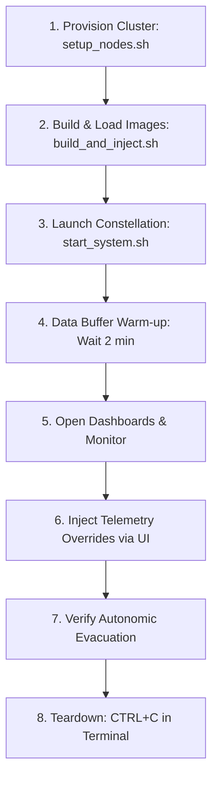

# Space Cloud V7.1 — Manual Demo & Verification Guide

This document outlines the standard operational procedures for running, monitoring, and validating a manual demonstration of the **Space Cloud V7.1** orbital Kubernetes constellation. This guide serves as the reference sequence for researchers and operators to verify container state migration under physical constraint overrides.

---

## 🛠️ Prerequisites

Before launching the demo, ensure the following tools are installed and configured on the host machine:
*   **Minikube** (configured with the `docker` driver)
*   **Kubectl** (configured to point to the active Minikube context)
*   **Docker** (installed on the host for local image building)
*   **Python 3.9+** with the `redis` library installed:
    ```bash
    pip install redis
    ```

---

## 📋 Step-by-Step Execution Guide



### 1. Provision Cluster Nodes (Run Once)
The first step provisions the virtual satellite constellation and configures the Kubernetes cluster.
*   **Command:**
    ```bash
    ./ops/setup_nodes.sh
    ```
*   **Frequency:** Only run **once** per development session, or after a system reboot/full cluster wipe.
*   **Key Operations Performed:**
    *   Deletes any existing Minikube instances and spins up a 4-node cluster using the Docker driver and CRI-O container runtime.
    *   Enables the `ContainerCheckpoint` feature gate inside the container runtime to support live CRIU checkpointing.
    *   Generates a Universal SSH Key (`/tmp/isl_key`) and copies it to all satellite nodes to allow passwordless SSH transfers between satellites.
    *   Generates a dynamic routing table mapped to the node container IPs.
    *   Patches the CRI-O configurations to enable CRIU support and pre-defines the runc settings (`tcp-established`, `manage-cgroups=ignore`).
    *   Labels the nodes according to functional roles:
        *   `minikube` $\rightarrow$ `type=ground-station`
        *   `minikube-m02` $\rightarrow$ `type=satellite` (Plane A)
        *   `minikube-m03` $\rightarrow$ `type=satellite` (Plane B)
        *   `minikube-m04` $\rightarrow$ `type=satellite` (Plane C)

---

### 2. Compile and Inject Code Changes
Whenever code updates are made to the sidecar, SML workload, node agent, or dashboards, rebuild and inject the containers.
*   **Command:**
    ```bash
    ./ops/build_and_inject.sh
    ```
*   **Frequency:** Run every time you make modifications to the satellite application or agent source files.
*   **Key Operations Performed:**
    *   Compiles 4 distinct container images on the host:
        *   `localhost/space-sidecar:latest` (stateful sidecar)
        *   `localhost/space-workload:latest` (tinySML inference worker)
        *   `localhost/space-node-agent:latest` (MPC node agent)
        *   `localhost/space-topology-dashboard:latest` (floating master monitor)
    *   Saves the compiled containers as `.tar` files, transfers them directly to the satellite nodes via `minikube cp`, and ingests them into the local runtimes using `buildah pull`.
    *   Pre-caches the base `redis:6.2-alpine` image to speed up CRIU restorations.
    *   Cleans up temporary `.tar` files on the host to free up disk space.

---

### 3. Launch the Constellation
Start the orchestrator, dashboards, simulator, and port-forwards.
*   **Command:**
    ```bash
    ./ops/start_system.sh
    ```
*   **Prompt Interaction:**
    When prompted: `❓ Run TABULA RASA (full cluster cleanup) before starting? (y/N): `
    *   Type **`N`** (or press Enter for default).
    *   *Why?* The cleanup of the previous deployment is handled automatically when you close the previous session (via a `SIGINT` trap handler in `start_system.sh`). Answering `N` skips the redundant, time-consuming full cluster deletion and speeds up startup.
*   **Key Operations Performed:**
    *   Deploys K8s resources: Ground Redis, Floating Master, dashboard service, Node Agent DaemonSet, and the SML Mission pod.
    *   Establishes persistent background port-forwards:
        *   `Ground Redis` $\rightarrow$ `6379:6379`
        *   `Floating Master Redis` $\rightarrow$ `6380:6379`
        *   `SML Dashboard` $\rightarrow$ `8080:80`
        *   `ISL Dashboard` $\rightarrow$ `8081:8081`
    *   Launches local ground-station helper processes on the host:
        *   **Environment Simulator** (`environment_sim.py`): Models satellite orbital physics, temperature variations, battery levels, solar exposure, and eclipse phases.
        *   **UDP Data Streamer** (`data_streamer.py`): Simulates Earth sensor observations streamed to the active satellite.
        *   **Global Swarm Dashboard** (`global_dashboard.py`): Starts the primary user interface server on port `8090`.

---

### 4. Telemetry Warm-Up Delay
*   **Action:** Once the console prints `✅ SPACE CLOUD V7.1 OPERATIONAL!`, **wait approximately 2 minutes**.
*   **Why?** The UDP Data Streamer requires time to fill the historical data buffers in `state_manager.js` and establish stable connections. Immediate interactions might result in incomplete data logs or premature migration triggers before the telemetry baseline is initialized.

---

### 5. Monitor the Constellation
Open your web browser and open the three dashboard screens:
1.  **Global Swarm Dashboard** ([http://localhost:8090](http://localhost:8090)): Displays the ground station view, real-time fleet map, active physical telemetry (battery, CPU temperature), and a migration history log.
2.  **SML Payload Dashboard** ([http://localhost:8080](http://localhost:8080)): Follows the stateful SML application. It automatically reconnects and updates as the SML pod migrates from one node to another.
3.  **ISL Topology Dashboard** ([http://localhost:8081](http://localhost:8081)): Shows the current Inter-Satellite Link (ISL) mesh connections and routing metrics stored in the Floating Master.

---

### 6. Inject Telemetry Overrides (Trigger Evacuation)
To test the self-healing and autonomic properties of the constellation, you can manually trigger an evacuation by simulating satellite distress.

1.  Identify which satellite node currently hosts the active workload (indicated in the dashboards, e.g., `minikube-m02`).
2.  Navigate to the **Telemetry Injector — Manual Override** panel on the **Global Swarm Dashboard** (`http://localhost:8090`).
3.  Select the active node from the drop-down menu.
4.  Enter distress values:
    *   **Temperature Override:** Set a value **$> 90^\circ\text{C}$** (e.g., $95^\circ\text{C}$ to simulate a thermal anomaly).
    *   *OR* **Battery Override:** Set a value **$< 5\%$** (e.g., $3\%$ to simulate critical battery exhaustion).
5.  Click **⚡ Inject Override**.
6.  **Verify the Action:**
    *   The dashboard telemetry row for that node will turn red and display an "Override Active" badge.
    *   The Node Agent running on that node detects the threshold violation.
    *   The Agent triggers a CRIU checkpoint of the stateful `space-sidecar`, packages the state, and runs `relay_transfer.sh` to copy it to a healthy target node (e.g., `minikube-m03`).
    *   The target node restores the sidecar container (`localhost/space-sidecar:restored`), while Kubernetes schedules a new workload pod there.
    *   The **SML Payload Dashboard** (`http://localhost:8080`) will momentarily display a disconnect state and then resume execution on the new node, preserving the application state.
7.  **Return to Normal Physics:**
    *   In the override panel, select the same node and click **Release Override**.
    *   The simulator returns the satellite to its normal physics calculations, allowing temperature to cool and batteries to recharge via simulated solar exposure.

---

### 7. View Live Metrics Logs (Optional)
If you want to view quantitative telemetry logs and record the "Big 3" thesis metrics (Survival rate, Migration delay, and Bandwidth footprint) in real-time:
*   Open a new terminal window.
*   Run the telemetry logging script:
    ```bash
    python3 ops/log_telemetry.py
    ```
*   **Output Example:**
    ```text
    📡 Telemetry Logger starting... Connecting to Ground Redis.
    ✅ Connected successfully. Subscribing to telemetry channels...
    🟢 MONITORING STARTED. Run your test and trigger a migration.
    ================================================================

    🚀 [EVENT] SML evacuated from minikube-m02 at 12:04:15
           ↳ Source Node State at Departure: 95.0°C | 88% Battery
    ⏳ [STATUS] Checkpoint transfer in-flight... waiting for landing.
    ----------------------------------------------------------------
    🏆 [TEST COMPLETED SUCCESFULLY]
       1. Hardware Survival:  ✅ 100% (Evacuated safely before thresholds)
       2. Migration Delay:     ⏱️  2.41 seconds
       3. Bandwidth Footprint: 💾 24.0 MB (Hops: 1)
       ↳ Source State at Departure: Temp: 95.0°C | Battery: 88%
    ----------------------------------------------------------------
    ```

---

### 8. System Teardown
To stop the simulation and clean up all deployed pods, services, and background threads:
*   Return to the terminal window running `./ops/start_system.sh`.
*   Press **`CTRL+C`**.
*   The script intercepts this signal and runs the `trap_cleanup` handler:
    *   Terminates local ground-station Python processes (`global_dashboard.py`, `data_streamer.py`, `environment_sim.py`).
    *   Deletes all deployed Kubernetes pods, deployments, and services.
    *   Cleans up temporary checkpoint images (`localhost/space-sidecar:restored`) on the Minikube satellite nodes.
